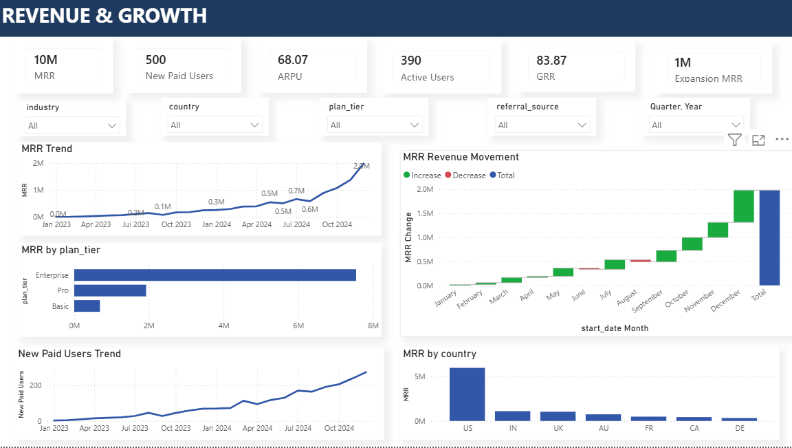
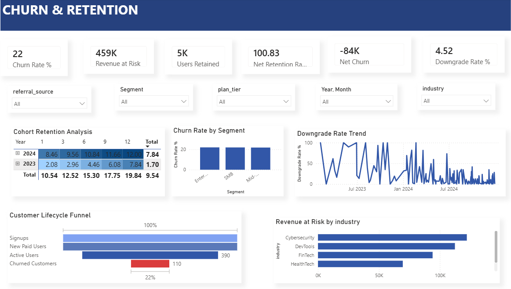
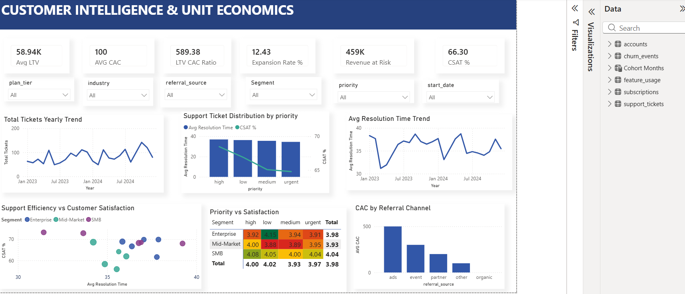

# SaaS Growth Sustainability: Revenue, Retention & Unit Economics Analysis


> A full-funnel analysis of a SaaS subscription business, covering revenue growth, churn, retention cohorts, customer segmentation, product adoption, and unit economics, built entirely with SQL and Python and delivered as a business case study.

---

## Executive Summary

This project analyzes 24 months of operational SaaS subscription data modeled on a B2B SaaS businessto answer a core business question: **is the company's revenue growth durable, or is it being propped up by new customer acquisition covering for weak retention?**

The dataset covers 5,000+ customer accounts across subscriptions, churn events, feature usage, and support tickets. The analysis The analysis evaluates revenue growth, customer retention, subscription economics, acquisition efficiency, product engagement, and customer health to determine whether growth is sustainable, then interpreted each result through a **Finding → Evidence → Interpretation → Business Impact → Next Analysis** framework.

**Headline result:** 
MRR increased from ₹4,684 in Jan 2023 to ₹22,73,427 in Dec 2024.
Annual churn reached 22%, significantly above many commonly reported SaaS benchmarks.
Multiple months experienced MRR contractions between 14% and 29%, indicating inconsistent growth.
Enterprise customers generated approximately 11× higher ARPU than Basic customers and achieved 105.24% Net Revenue Retention.
Recommendations focus on strengthening retention, protecting high-value enterprise accounts, and improving churn data quality.

---

## Business Context

A SaaS company operating on a subscription-based revenue model needs to determine whether its growth is sustainable or primarily driven by replacing customers lost to churn. Two companies can report similar revenue growth while one expands through strong customer retention and the other depends on constant acquisition to offset customer losses.

This project is framed as an analytical engagement for SaaS leadership, including Finance, Revenue Operations, and Customer Success to evaluate the quality and sustainability of revenue growth. The objective is to identify the customer segments, subscription plans, and operational factors that drive long-term business performance.

The analysis addresses questions such as:

Whether current MRR growth reflects sustainable expansion or is being offset by customer churn.
Which customer segments, industries, and subscription plans generate the strongest long-term value and which require retention-focused intervention.
Whether customer health metrics and support interactions can serve as early warning indicators of future churn.

---

## Business Problem

The analysis was structured around the following business questions:

- Is MRR growth accelerating, decelerating, or masking underlying churn?
- Which plan tiers and industries generate the most (and least efficient) revenue?
- What is the company's actual churn rate, and does it vary by plan, industry, or segment?
- How long do customers stay before churning, and when does risk peak?
- Which customer segments (SMB / Midmarket / Enterprise) are most profitable and most at risk?
- Do product usage and support satisfaction data predict churn?
- Which acquisition channels deliver the best LTV:CAC economics?

---

## Project Objectives

- Build a cleaned, validated, analysis-ready dataset from five raw source tables
- Calculate core SaaS revenue metrics: MRR, ARR, ARPU, and MRR growth rate
- Quantify churn overall and by plan tier, industry, and reason code
- Build retention cohorts tracking survival at 1, 3, 6, and 12 months
- Segment accounts (SMB / Midmarket / Enterprise) and compare MRR, churn, satisfaction, and expansion/downgrade behavior
- Evaluate customer health signals (feature usage, error rates, support satisfaction) against churn
- Calculate LTV and LTV:CAC by plan tier and referral source
- Present all quantitative results as evidence-based findings, and develop business insights and recommendations only for the most impactful patterns identified in the analysis.

---

## Dataset Overview

| Attribute | Detail |
|---|---|
| Time period | 24 months of subscription data (Jan 2023 - Dec 2024) |
| Scale | 5,000+ customer accounts |
| Source tables | 5 CSV files: accounts, subscriptions, churn_events, feature_usage, support_tickets |
| Record counts (raw) | Accounts: 500 · Churn events: 600 · Feature usage: 25,000 · Subscriptions: 5,000 · Support tickets: 2,000 |
| Record counts (cleaned) | Feature usage reduced to 24,979 rows after duplicate removal; other tables unchanged in row count post-cleaning |
| Domains covered | Revenue, churn, expansion/downgrades, subscriptions, feature usage, support interactions |

---

## Data Dictionary

**accounts**
| Field | Description |
|---|---|
| account_id | Unique account identifier |
| account_name | Customer/company name |
| industry | Industry vertical (e.g., Fintech, DevTools, EdTech, HealthTech, Cybersecurity) |
| country | Customer country |
| referral_source | Acquisition channel (organic, partner, ads, event, other) |
| plan_tier | Basic / Pro / Enterprise |
| signup_date | Date the account signed up |
| is_trial | Whether the account started as a trial |
| churn_flag | Whether the account has churned |
| seats | Number of licensed seats |

**subscriptions**
| Field | Description |
|---|---|
| subscription_id | Unique subscription identifier |
| account_id | Linked account |
| plan_tier / billing_frequency | Plan and monthly/annual billing cadence |
| start_date / end_date | Subscription lifecycle dates |
| is_trial, upgrade_flag, downgrade_flag, churn_flag, auto_renew_flag |
| seats | Seats on this subscription |
| mrr_amount / arr_amount | Monthly and annual recurring revenue |

**churn_events**
| Field | Description |
|---|---|
| churn_event_id | Unique churn event identifier |
| account_id | Linked account |
| reason_code | Stated churn reason (features, pricing, budget, support, unknown, etc.) |
| feedback_text | Free-text churn feedback |
| churn_date | Date of churn |
| preceding_upgrade_flag / preceding_downgrade_flag | Plan change immediately before churn |
| is_reactivation | Whether this churn record follows a prior reactivation |
| refund_amount_usd | Refund issued at churn |

**feature_usage**
| Field | Description |
|---|---|
| usage_id | Unique usage record identifier |
| subscription_id | Linked subscription |
| feature_name | Product feature used |
| usage_date | Date of usage |
| is_beta_feature | Whether the feature is in beta |
| usage_count / usage_duration_secs / error_count | Usage volume, duration, and error incidence |

**support_tickets**
| Field | Description |
|---|---|
| ticket_id | Unique ticket identifier |
| account_id | Linked account |
| priority | Ticket priority level |
| submitted_at / closed_at | Ticket lifecycle timestamps |
| resolution_time_hours / first_response_time_minutes | Support SLA metrics |
| satisfaction_score | Post-resolution CSAT score |
| escalation_flag | Whether the ticket was escalated |

---

## Data Cleaning & Preparation

Cleaning was performed in Python (pandas) across all five source tables before any SQL analysis, using a repeatable, table-specific pipeline:

- **Whitespace and string standardization** :- stripped leading/trailing whitespace and normalized empty strings/placeholder text (`'nan'`, `'None'`) to true nulls across identifier and categorical columns.
- **Boolean normalization** :- mapped inconsistent boolean representations (`TRUE/FALSE`, `true/false`, `1/0`, `Yes/No`) to a single nullable boolean type for flags such as `is_trial`, `churn_flag`, `upgrade_flag`, and `escalation_flag`, since inconsistent casing/formats would otherwise break `WHERE` filters in SQL.
- **Numeric coercion** :- converted amount and count fields (seats, MRR, ARR, usage counts, error counts, satisfaction scores) to numeric types with invalid values coerced to null, so aggregate functions wouldn't silently drop or misinterpret non-numeric strings.
- **Date parsing** :- parsed date-only fields (signup, churn, usage, start/end dates) and combined date-time fields (ticket close timestamps) into proper datetime types, needed for cohort and lifetime calculations that depend on `DATEDIFF`-style logic.
- **Missing value handling** :- applied targeted imputation strategies: median for skew-prone numeric fields (seats, satisfaction score), zero for count/amount fields where missing plausibly means "none" (refund amount, usage/error counts), and an explicit `"Unknown"` label for missing categorical fields (industry, referral source, plan tier) rather than dropping rows.
- **Duplicate removal** :- deduplicated each table on its primary key (`account_id`, `subscription_id`, `churn_event_id`, `usage_id`, `ticket_id`), which reduced feature_usage from 25,000 to 24,979 rows.
- **Referential integrity validation** :- checked that foreign keys (subscriptions → accounts, churn_events → accounts, support_tickets → accounts, feature_usage → subscriptions) all resolved to valid parent records before the cleaned files were used for analysis.

---

## Data Architecture & Transformation

The SQL analysis (`saas_queries.sql`) is organized into seven business sections:  Revenue, Churn, Cohort/Retention, Segmentation, Customer Health, Revenue Forecasting, and Unit Economics and relies on a consistent set of SQL techniques, each chosen for a specific analytical need:

- **CTEs (`WITH` clauses)** :  used throughout to break multi-step calculations (e.g., MRR by month -> lagged MRR -> growth rate; lifetime days -> LTV per account -> LTV summary by segment) into readable, auditable stages rather than deeply nested subqueries.
- **Window functions (`LAG() OVER`, `ROW_NUMBER() OVER`)** : used to compare each month's MRR/ARR to the prior period for growth-rate calculations, and to select each account's most recent subscription record when building cohort retention logic.
- **`CASE` statements** : used extensively to bucket continuous values into business categories: seat count into SMB/Midmarket/Enterprise segments, LTV:CAC ratio into health labels (Healthy/Break-even/Loss), and churn timing into 1/3/6/12-month retention flags.
- **Joins across accounts, subscriptions, churn_events, feature_usage, and support_tickets** : used to connect account-level attributes (industry, plan tier, segment) to transactional data (revenue, churn, usage, tickets) so metrics could be sliced by business dimension.
- **Aggregations (`SUM`, `AVG`, `COUNT DISTINCT`, `ROUND`)** : used to calculate MRR/ARR totals, ARPU, churn rates, average customer lifetime, and satisfaction scores at the plan-tier, industry, and segment level.
- **Date functions (`DATE_FORMAT`, `DATEDIFF`, `TIMESTAMPDIFF`)** : used to roll transaction-level dates into monthly cohorts and to calculate subscription lifetime in days/months for churn-timing and LTV analysis.
- **Correlated and scalar subqueries** : used to benchmark individual segments against company-wide averages (e.g., flagging high-risk accounts whose usage is below and error count is above the overall feature-usage average).

---

## Analytical Methodology

```
Data Import (5 raw CSVs)
        ↓
Cleaning & Standardization (pandas pipeline)
        ↓
Referential Integrity Validation
        ↓
SQL-Based Exploratory Analysis (7 business sections)
        ↓
KPI Calculation (MRR, ARR, ARPU, Churn Rate, LTV, LTV:CAC)
        ↓
Segmentation (Plan Tier, Industry, Company Size, Referral Source)
        ↓
Business Interpretation (Finding -> Evidence -> Hypothesis -> Impact -> Next Analysis)
        ↓
Recommendations & Prioritized Next Steps
```

---

## Exploratory Data Analysis

The exploratory work in `saas_queries.sql` moved through five progressively deeper questions per business area: (1) what is the headline metric, (2) how does it break down by plan tier/industry/segment, (3) how has it moved over time, (4) which reason codes or channels explain it, and (5) what would validate or support the resulting hypothesis.

---

## SQL Analysis

Rather than reproducing every query, the table below highlights the queries that drove the report's core findings:

| Business Question | Technique Used | What It Answered |
|---|---|---|
| MRR/ARR trend and growth rate | CTE + `LAG()` window function | Whether month-over-month revenue growth is accelerating or decelerating |
| MRR by plan tier / industry | `JOIN` + `GROUP BY` + percentage-of-total | Which plan tiers and industries drive the largest share of recurring revenue |
| Overall and segmented churn rate | CTE + conditional aggregation | Company-wide churn rate and its breakdown by plan tier, industry, and segment |
| Cohort retention at 1/3/6/12 months | CTE + `ROW_NUMBER()` + `DATEDIFF` + `CASE` | When during the customer lifecycle retention risk actually emerges |
| Segment MRR, churn, satisfaction, upgrade/downgrade | `CASE`-based segmentation + multi-table `JOIN` | How SMB, Midmarket, and Enterprise accounts differ economically and behaviorally |
| High-risk account scoring | Correlated subqueries against company averages | Which active accounts show low usage, high errors, and low satisfaction simultaneously |
| LTV and LTV:CAC by plan tier / referral source | CTE chain (lifetime → LTV per account → LTV summary) | Which plan tiers and acquisition channels are most capital-efficient |

---

## Dashboard Overview

A 3-page Power BI dashboard was built on top of the same six cleaned tables used in the SQL analysis (accounts, subscriptions, churn_events, feature_usage, support_tickets, plus a supporting Cohort Months table), giving stakeholders an interactive way to explore the KPIs without writing SQL. Each page uses a consistent layout. KPI cards across the top, slicers directly below, and supporting visuals underneath with cross-filtering shared across every chart on the page.

### Page 1 — Revenue & Growth

**Purpose:** Track how recurring revenue and paid-user growth are trending, and where that revenue is concentrated.

**KPI cards:** MRR (10M) · New Paid Users (500) · ARPU (68.07) · Active Users (390) · GRR (83.87) · Expansion MRR (1M)

**Filters:** industry, country, plan_tier, referral_source, Quarter/Year

**Visuals:**
- **MRR Trend** : line chart of total MRR from Jan 2023 to Oct 2024, climbing from near-zero to roughly 2M
- **MRR by plan_tier** : horizontal bar chart showing Enterprise contributing the largest share of MRR, followed by Pro and Basic
- **MRR Revenue Movement** : monthly waterfall chart isolating increases (green) vs. decreases (red) vs. the running total (blue), making it possible to spot which specific months had a net revenue decline
- **New Paid Users Trend** : line chart of new paid user acquisition over the same 24-month window
- **MRR by country** : bar chart ranking MRR contribution by country, led by the US ahead of India, UK, Australia, France, Canada, and Germany



### Page 2 — Churn & Retention

**Purpose:** Quantify churn and retention exposure, and identify which segments and industries carry the most revenue risk.

**KPI cards:** Churn Rate % (22) · Revenue at Risk (459K) · Users Retained (5K) · Net Retention Rate (100.83) · Net Churn (-84K) · Downgrade Rate % (4.52)

**Filters:** referral_source, Segment, plan_tier, Year/Month, industry

**Visuals:**
- **Cohort Retention Analysis** : matrix breaking down percentages by signup cohort year across the 1/3/6/9/12-month marks (e.g., 2024 cohort: 8.46% at month 1 rising to 12.00% at month 12; 2023 cohort: 2.08% rising to 7.84%)
- **Churn Rate by Segment** : bar chart comparing Enterprise, SMB, and Mid-Market, with all three segments in a similar range
- **Downgrade Rate Trend** : line chart of downgrade rate over time (Jul 2023–Jul 2024), highly volatile month to month
- **Customer Lifecycle Funnel** : funnel from Signups (100%) through New Paid Users and Active Users (390) down to Churned Customers (110, 22%)
- **Revenue at Risk by industry**: bar chart ranking Cybersecurity, DevTools, FinTech, and HealthTech by exposed revenue



### Page 3 — Customer Intelligence & Unit Economics

**Purpose:** Connect support/product experience data to unit economics, so Customer Success and Finance stakeholders can see satisfaction, resolution performance, and acquisition efficiency side by side.

**KPI cards:** Avg LTV (58.94K) · Avg CAC (100) · LTV:CAC Ratio (589.38) · Expansion Rate % (12.43) · Revenue at Risk (459K) · CSAT % (66.30)

**Filters:** plan_tier, industry, referral_source, Segment, priority, start_date

**Visuals:**
- **Total Tickets Yearly Trend** : line chart of ticket volume from Jan 2023 to Jul 2024
- **Support Ticket Distribution by priority** : combination chart showing average resolution time by priority level (high, low, medium, urgent) against a CSAT % trend line
- **Avg Resolution Time Trend** : line chart of average resolution time over the same period
- **Support Efficiency vs Customer Satisfaction** : scatter plot of CSAT % against average resolution time, colored by segment (Enterprise, Mid-Market, SMB), used to check whether slower resolution correlates with lower satisfaction
- **Priority vs Satisfaction** : matrix of average satisfaction score by segment and ticket priority
- **CAC by Referral Channel** : bar chart ranking average CAC by referral source, with ads the most expensive channel and organic the least




---

## Key Findings

**Finding:** MRR grew from ₹4,684 (Jan 2023) to ₹22,73,427 (Dec 2024), with early monthly growth of 133–136% giving way to several months of -14% to -29% contraction.
**Evidence:** Monthly MRR series with month-over-month growth rate calculated via lagged CTE.
**Business implication:** Without a decomposed MRR bridge (new vs. expansion vs. downgrade vs. churn), it is unclear whether negative months reflect a retention problem or an acquisition gap flagged as the top-priority follow-up analysis.

**Finding:** Overall annual churn rate is 22%.
**Evidence:** Churned vs. total accounts calculated across the full subscription base.
**Business implication:** MRR is still growing overall, but a churn rate roughly double common SaaS benchmarks means part of new-customer revenue may be replacing lost revenue rather than adding net-new growth.

**Finding:** Enterprise ARPU (₹167) is 11x Basic ARPU (₹16); Enterprise is the only plan tier with Net Revenue Retention above 100% (105.24%), and Enterprise churn (5.71%) is roughly 4x lower than SMB (21.98%) or Midmarket (23.93%).
**Evidence:** ARPU by plan tier, NRR by plan tier table, churn by segment.
**Business implication:** Enterprise is the most economically attractive segment (highest ARPU, highest LTV, lowest churn, expansion-positive NRR) but represents only a small share of the customer base and ~5% of total MRR.

**Finding:** Midmarket contributes approximately 71% of total MRR (₹78,24,134), versus 25% for SMB and 5% for Enterprise.
**Evidence:** MRR by segment breakdown.
**Business implication:** The business is currently dependent on Midmarket revenue; any retention weakness there has an outsized impact on total recurring revenue.

**Finding:** Retention cohorts show minimal drop-off through month 6 (88–100% across cohorts) but a steeper decline by month 12 (65–100%, with wide cohort variance).
**Evidence:** Cohort survival table for 1/3/6/12-month marks across multiple signup cohorts.
**Business implication:** Retention risk concentrates in the 6–12 month window, suggesting renewal-cycle timing (rather than early onboarding) may be the larger churn driver for at least some cohorts.

**Finding:** DevTools has the highest industry churn rate (30%) versus Fintech (22.32%), even though Fintech and DevTools have similar subscriber counts; Fintech generates the highest MRR-per-subscription (₹2,426) and 23% of total MRR.
**Evidence:** Churn-by-industry and MRR-by-industry breakdowns.
**Business implication:** Fintech combines high revenue concentration with above-average churn, making it a high-stakes retention priority; DevTools' high churn despite similar volume to Fintech suggests a segment-specific retention issue.

**Finding:** Across every customer segment, downgrades outnumber upgrades by roughly 8–9x (e.g., Enterprise: 0.79% upgrade vs. 7.10% downgrade).
**Evidence:** Upgrade/downgrade rate by segment.
**Business implication:** Downgrade behavior appears widespread rather than segment-specific and may serve as an early warning signal worth correlating with subsequent churn.

**Finding:** Only 17% of churned customers ever reactivate; 83% never return.
**Evidence:** Reactivation rate calculated from churn_events.
**Business implication:** Win-back campaigns have a structurally low ceiling, the report concludes that improving retention among active customers likely has more revenue impact than reactivation efforts.

**Finding:** No single product feature clearly separates churned from retained accounts (Feature 7 shows the highest "never churned" share at 92%, but no feature shows a dominant retention effect).
**Evidence:** Feature usage comparison between churned and retained accounts.
**Business implication:** Breadth of feature adoption, rather than use of any one feature, may be the more meaningful retention signal, this needs account-level validation.


**Finding:** Refund amounts are highest for churns categorized as "Unknown" reason code (₹18.34 average), ahead of Features (₹16.72), Pricing (₹14.65), Budget (₹12.00), and Support (₹11.73).
**Evidence:** Average refund by churn reason code.
**Business implication:** A meaningful share of churns carry no diagnostic reason, limiting the business's ability to prioritize root-cause fixes — the report recommends adding a mandatory exit survey.

**Finding:** Customer lifetime before churn varies sharply by referral source, Organic customers average 54 days versus 571–591 days (roughly 19 months) for Event, Other, Ads, and Partner channels. Using assumed CAC figures, all channels exceed a 3:1 LTV:CAC ratio, with Partner and Other showing the strongest capital efficiency.
**Evidence:** Customer lifetime by referral source; LTV:CAC ratio table by channel.
**Business implication:** Signup-volume-based channel evaluation likely overstates Organic's contribution; the LTV:CAC conclusions are directional only, since CAC values are assumed rather than sourced from actual marketing spend.

---

## Business Insights

- **Growth quality is unconfirmed.** MRR is rising in aggregate, but the presence of multiple double-digit negative-growth months alongside a churn rate near double typical benchmarks means the topline number alone cannot confirm whether growth is durable or churn-masked. This is the single highest-priority open question in the analysis.
- **Enterprise is a disproportionately valuable but underweighted segment.** It has the best unit economics on every axis measured (ARPU, LTV, NRR, churn) but the smallest revenue share — the report treats this as the clearest growth lever, conditional on validating Enterprise CAC.
- **Satisfaction is uniformly weak.** All three segments score below the neutral midpoint (SMB 2.33, Midmarket 2.36, Enterprise 2.61 out of 5), suggesting a company-wide customer experience issue rather than a segment-specific one.
- **Churn-reason data has a visibility gap.** With "Unknown" as the highest-refund churn category, the business currently lacks the structured feedback needed to prioritize retention fixes with confidence.


---

## Recommendations

1. **Improve early customer onboarding.** Basic-tier customers churn fastest (average lifetime: 57 days), and customers who churn within 3 months do so around day 40 on average. Review onboarding flow and activation messaging in the first 30–60 days, then A/B test retention before and after changes.
2. **Investigate the Enterprise growth opportunity.** Before increasing Enterprise acquisition spend, compare actual Enterprise CAC to Basic/Pro CAC to confirm the segment's superior LTV, NRR, and churn profile translate into a favorable payback period.
3. **Build a proactive account health monitoring process for Enterprise and Midmarket.** Enterprise carries the highest revenue-at-risk (₹318K) despite low churn; Midmarket drives 71% of total MRR. A lightweight monitoring workflow flagging declining usage, low satisfaction, or recent downgrades could let Customer Success intervene before churn occurs.
4. **Replace assumed CAC with actual marketing spend by channel.** Current LTV:CAC conclusions (e.g., Partner outperforming Ads) are directionally useful but depend entirely on assumed acquisition costs, validate with real spend data before reallocating budget.
5. **Add a mandatory exit survey at cancellation.** Structured churn-reason capture would close the "Unknown" reason-code gap and give Product and CS teams a defensible basis for prioritizing fixes.
7. **Build a monthly MRR bridge (New + Expansion - Downgrade - Churn = Net Change).** This is the report's top-priority next analysis and is required to determine whether negative-growth months are driven by churn/downgrades or by acquisition timing gaps.

---

## Project Limitations

- The underlying dataset is **simulated**, not live production data; absolute figures should be read as illustrative of methodology rather than real business performance.
- **CAC values used in LTV:CAC analysis are assumed**, not sourced from actual marketing spend, and are explicitly flagged in the report as requiring validation before informing budget decisions.
- Several report conclusions are stated as **hypotheses, not confirmed causal relationships** (e.g., the link between product errors and early churn, or feature adoption breadth and retention), the report is explicit that customer-level behavioral analysis is still required to validate them.
- A monthly MRR bridge (decomposing growth into new, expansion, downgrade, and churn components) had not yet been completed at the time of this report and is called out as the top follow-up analysis.

---

## Skills Demonstrated

- SQL: CTEs, window functions, correlated subqueries, multi-table joins, conditional aggregation
- Data cleaning and validation with Python (pandas)
- Referential integrity checks across relational tables
- SaaS metric design: MRR, ARR, ARPU, churn rate, NRR, LTV, LTV:CAC
- Cohort retention analysis
- Customer segmentation (SMB / Midmarket / Enterprise)
- Root-cause / hypothesis-driven business analysis
- Identification and documentation of a query logic defect (health-scoring model)
- Business storytelling: translating query output into stakeholder-ready findings and recommendations

---

## Repository Structure

```
project/
├── sql/
│   └── saas_queries.sql
├── notebooks/
│   └── SaaS_Cleaning.ipynb
├── documentation/
│   └── SAAS_BUSNESS_ANALYTICS_REPORT.pdf
├── images/
│   ├── dashboard_revenue_growth.png
│   ├── dashboard_churn_retention.png
│   └── dashboard_customer_intelligence.png
└── README.md
```

---

## Future Improvements

- Build the monthly MRR bridge (new / expansion / downgrade / churn) identified as the top-priority follow-up analysis in the report
- Replace assumed CAC figures with actual marketing spend data by channel
- Add a structured exit-survey data source to close the "Unknown" churn-reason gap
- Extend cohort analysis to compare 2023 vs. 2024 cohorts for the 6–12 month churn pattern
- Automate the cleaning pipeline into a scheduled ETL process rather than a manual notebook run
